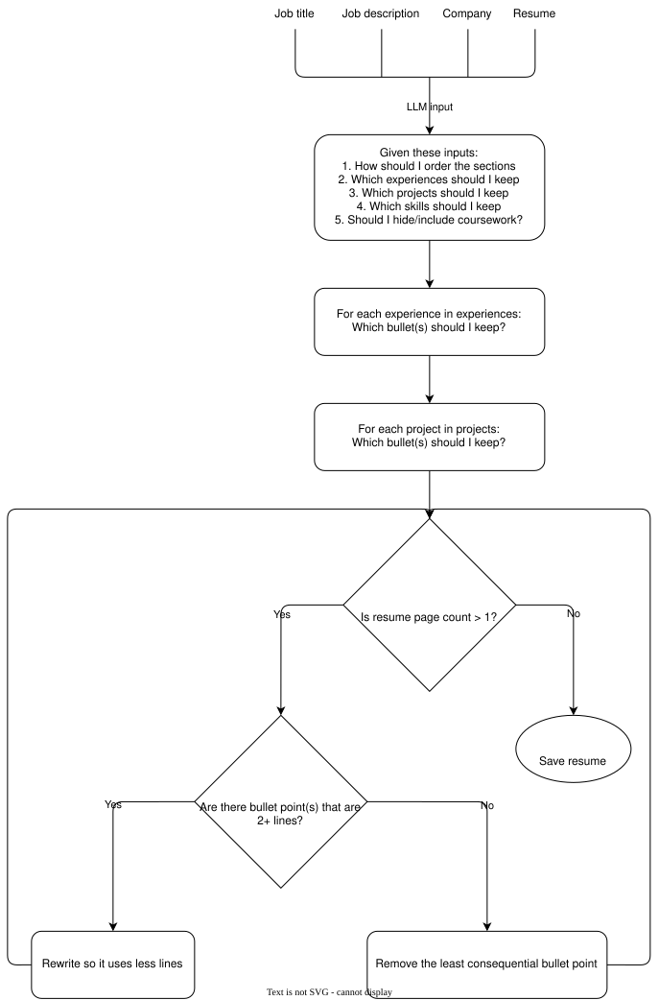

<div align="center">
<h1>Resume</h1>


<br>


<br>
LLM-assisted, deterministic LaTeX resume tailoring.
</div>

## Requirements
- [x] [LaTeX](https://www.latex-project.org/get) (including [`latexmk`](https://www.cantab.net/users/johncollins/latexmk))
- [x] [Conda](https://www.anaconda.com/download) (preferred) or [Python](https://www.python.org/downloads)
- [x] [Visual Studio Code](https://code.visualstudio.com)

## Installation
Clone and enter the repository
  ```sh
  git clone https://github.com/lynkos/resume.git && cd resume
  ```

> [!IMPORTANT]
> Make sure a LaTeX installation with `latexmk` (e.g. `/Library/TeX/texbin`) is in your `PATH` environment variable

## Tailor Resume
<div align="center">
  
</div>

### Quick Start
1. Create new Conda environment `resume_env`
   ```sh
   conda create -n resume_env python=3.14 pip -y
   ```

2. Activate environment
   ```sh
   conda activate resume_env
   ```

3. For testing, install optional dependencies
   ```sh
   python -m pip install -e ".[dev]"
   ```

4. Create `.env` file with these values and configure accordingly
   ```
   OPENAI_API_KEY="YOUR_API_KEY"
   OPENAI_MODEL="MODEL_NAME"
   EMAIL="EMAIL@DOMAIN.com"
   PHONE_NUMBER="+1 (234) 567--8900"
   ```

5. If needed, edit [`resume.yaml`](resume.yaml)

### Usage
Generate a resume for a job description in `jobs/archil.txt`
   ```sh
   resume \
     --jd-file jobs/archil.txt \
     --title "Distributed Systems Engineer" \
     --company "Archil"
   ```

Generate a resume for a job description provided via CLI
   ```sh
   resume --jd "Full job description here..." --title "Software Engineer"
   ```

Generate resume for `job.txt` with `draft.json` (instead of requesting new initial draft)
   ```sh
   resume \
     --jd-file job.txt \
     --title "Software Engineer" \
     --company "Some National Laboratory" \
     --draft-file draft.json \
     --max-backfill-attempts 0 \
     --max-fit-retries 0
   ```

Allow up to 2 pages
   ```sh
   resume --jd-file job.txt --max-pages 2
   ```

Disable both page fitting and backfill
   ```sh
   resume --jd-file job.txt --no-page-limit
   ```

Disable backfill (increasing it allows more candidate trials and LaTeX compilations)
   ```sh
   resume --jd-file job.txt --max-backfill-attempts 0
   ```

| Name                  | Default         |
| --------------------- | --------------- |
| Config                | `resume.yaml`   |
| Template              | `resume.tex.j2` |
| Output Directory      | `Resume/build`  |
| Max Pages             | `1`             |
| Max Retries           | `8`             |
| Max Backfill Attempts | `6`             |

### Testing
```sh
PYTHONPATH=src python -m pytest -q tests/test_backfill.py
```

## View Resume
1. Open Visual Studio Code
2. Download [LaTeX Workshop extension](https://marketplace.visualstudio.com/items?itemName=James-Yu.latex-workshop)
3. Open the Command Palette
    * Mac: <kbd>Command ⌘</kbd> + <kbd>Shift</kbd> + <kbd>P</kbd>
    * Windows: <kbd>Ctrl</kbd> + <kbd>Shift</kbd> + <kbd>P</kbd>
4. Search and select `Preferences: Open User Settings (JSON)`
5. Add the following lines to `settings.json`:
   ```json
    "latex-workshop.latex.tools": [
       {
         "name": "latexmk",
         "command": "latexmk",
         "args": [
           "-lualatex",
           "-interaction=nonstopmode",
           "-file-line-error",
           "-pdf",
           "-outdir=%OUTDIR%",
           "%DOC%"
         ],
         "env": {
           "EMAIL": "EMAIL@DOMAIN.com",
           "PHONE_NUMBER": "+1 (234) 567--8900"
         }
       },
       {
         "name": "lualatex",
         "command": "lualatex",
         "args": [
           "-interaction=nonstopmode",
           "-file-line-error",
           "-pdf",
           "%DOC%"
         ],
         "env": {
           "EMAIL": "EMAIL@DOMAIN.com",
           "PHONE_NUMBER": "+1 (234) 567--8900"
         }
       },
       {
         "name": "xelatex",
         "command": "xelatex",
         "args": [
           "-interaction=nonstopmode",
           "-file-line-error",
           "-pdf",
           "%DOC%"
         ],
         "env": {}
       },
       {
         "name": "pdflatex",
         "command": "pdflatex",
         "args": [
           "-interaction=nonstopmode",
           "-file-line-error",
           "%DOC%"
         ],
         "env": {}
       },
       {
         "name": "bibtex",
         "command": "bibtex",
         "args": [ "%DOCFILE%" ],
         "env": {}
       }
    ],
    "latex-workshop.latex.recipes": [
       {
         "name": "lualatex",
         "tools": [ "lualatex" ]
       },
       {
         "name": "pdfLaTeX",
         "tools": [ "pdflatex" ]
       },
       {
         "name": "latexmk",
         "tools": [ "latexmk" ]
       },
       {
         "name": "xelatex",
         "tools": [ "xelatex" ]
       },
       {
         "name": "bibtex",
         "tools": [ "bibtex" ]
       }
    ],
    "latex-workshop.view.pdf.viewer": "tab",
   ```
6.  Save changes to `settings.json` file
    * Mac: <kbd>Command ⌘</kbd> + <kbd>S</kbd>
    * Windows: <kbd>Ctrl</kbd> + <kbd>S</kbd>
7. Open newly cloned `resume` directory in Visual Studio Code
8. Open or create a `.tex` file you want to edit
9. Edit the file as you see fit
10.  Compile the file
     * Mac: <kbd>Command ⌘</kbd> + <kbd>Option ⌥</kbd> + <kbd>B</kbd>
     * Windows: <kbd>Ctrl</kbd> + <kbd>Alt</kbd> + <kbd>B</kbd>
11.  View the `.pdf` output
     * Mac: <kbd>Command ⌘</kbd> + <kbd>Option ⌥</kbd> + <kbd>V</kbd>
     * Windows: <kbd>Ctrl</kbd> + <kbd>Alt</kbd> + <kbd>V</kbd>

## References
- [LaTeX Workshop Wiki](https://github.com/James-Yu/LaTeX-Workshop/wiki)
- [How to use LaTeX in VScode as an Overleaf alternative](https://groundwater.usu.edu/blog/2025/Use-Latex-in-VScode)
- [Writing LaTeX Documents In Visual Studio Code With LaTeX Workshop](https://medium.com/@rcpassos/writing-latex-documents-in-visual-studio-code-with-latex-workshop-d9af6a6b2815)
- [A Fast Guide on Writing LaTeX with LaTeX Workshop in VS Code](https://mathjiajia.github.io/vscode-and-latex)